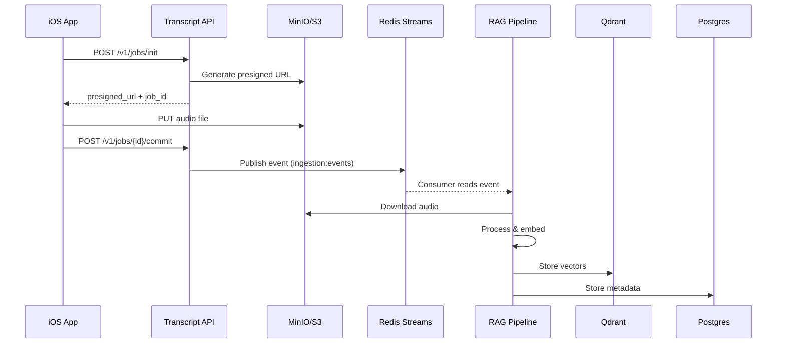

# Infrastructure Setup Guide

## Vue d'ensemble

Cette documentation décrit l'infrastructure complète du système RAG et les procédures de mise en place pour le développement local et le déploiement.

## Architecture des Services

### Services Principaux

| Service | Port(s) | Description | Dépendances |
|---------|---------|-------------|-------------|
| **app** | 8000 | Application principale FastAPI | postgres, redis, qdrant, minio |
| **postgres** | 5432 | Base de données PostgreSQL 16 | - |
| **redis** | 6379 | Cache et Redis Streams pour événements | - |
| **qdrant** | 6333 (HTTP), 6334 (gRPC) | Vector database pour embeddings | - |
| **minio** | 9000 (API), 9001 (Console) | Object storage S3-compatible | - |
| **minio-init** | - | Service d'initialisation MinIO | minio |
| **prometheus** | 9090 | Monitoring et métriques | - |
| **grafana** | 3000 | Dashboards de monitoring | prometheus |
| **nginx** | 80, 443 | Reverse proxy (production uniquement) | app |

## Prérequis

### Développement Local

- Docker Desktop 20.10+
- Docker Compose 2.0+
- Python 3.11+ (pour développement hors Docker)
- Make (GNU Make)
- Git

### Matériel Recommandé

- **Développement**: 16GB RAM minimum, 50GB espace disque
- **Production RTX 3090**: 24GB VRAM GPU, 32GB RAM système minimum

## Installation Rapide

### 1. Clone et Configuration Initiale

```bash
# Clone du repository
git clone <repo-url>
cd my-RAG

# Setup automatique (crée .env, installe dépendances)
make setup
```

### 2. Configuration Environnement

Éditez le fichier `.env` créé à partir de `config/environments/.env.example`:

```bash
# Éditeur de votre choix
nano .env
# ou
code .env
```

**Variables critiques à configurer**:

```env
# PostgreSQL
POSTGRES_PASSWORD=changez-ce-mot-de-passe

# MinIO
MINIO_ROOT_USER=votre-username
MINIO_ROOT_PASSWORD=mot-de-passe-fort

# Security
SECRET_KEY=generer-une-cle-secrete-forte
JWT_SECRET_KEY=generer-une-autre-cle-forte

# LLM (selon votre provider)
OPENAI_API_KEY=sk-...
# ou
ANTHROPIC_API_KEY=sk-ant-...
```

### 3. Démarrage des Services

```bash
# Démarrer tous les services
make docker-up

# Vérifier le status
make status
```

### 4. Initialisation MinIO

```bash
# Initialiser les buckets et politiques
make minio-init

# Vérifier les buckets créés
make minio-buckets
```

## Commandes Make Principales

### Gestion Docker

```bash
make docker-up          # Démarrer tous les services
make docker-down        # Arrêter tous les services
make docker-restart     # Redémarrer tous les services
make docker-rebuild     # Rebuild complet (sans cache)
make docker-logs        # Voir tous les logs
make docker-logs-app    # Logs de l'app uniquement
make docker-clean       # Nettoyer volumes et images
make status             # Afficher le status des services
```

### Opérations MinIO

```bash
make minio-init         # Initialiser buckets et policies
make minio-console      # Ouvrir la console MinIO
make minio-buckets      # Lister les buckets
make minio-upload-test  # Tester l'upload
make minio-logs         # Voir les logs MinIO
```

### Opérations Qdrant

```bash
make qdrant-dashboard   # Ouvrir le dashboard Qdrant
make qdrant-collections # Lister les collections
make qdrant-health      # Vérifier la santé de Qdrant
make qdrant-logs        # Voir les logs Qdrant
```

### Opérations Redis

```bash
make redis-cli          # Ouvrir Redis CLI
make redis-monitor      # Monitor les commandes en temps réel
make redis-streams      # Afficher info sur les streams
make redis-logs         # Voir les logs Redis
```

### Opérations Base de Données

```bash
make db-shell           # Ouvrir psql shell
make db-migrate         # Exécuter les migrations
make db-rollback        # Rollback dernière migration
make db-reset           # Reset complet de la DB
make db-backup          # Backup de la DB
```

## Configuration des Services

### PostgreSQL

**Base de données**: `ragdb`
**User**: `raguser` (configurable dans .env)
**Port**: `5432`

```bash
# Connexion depuis l'hôte
psql -h localhost -U raguser -d ragdb

# Connexion depuis Docker
make db-shell
```

### Redis

**Port**: `6379`
**Streams utilisés**:
- `ingestion:events` - Events d'ingestion audio

```bash
# Tester Redis
docker exec -it rag-redis redis-cli ping
# PONG

# Voir les streams
make redis-streams
```

### Qdrant

**Ports**:
- HTTP API: `6333`
- gRPC: `6334`
- Dashboard: `http://localhost:6333/dashboard`

**Collections**:
- `conversations` - Embeddings de conversations

```bash
# Vérifier la santé
curl http://localhost:6333/healthz

# Lister les collections
curl http://localhost:6333/collections | jq
```

### MinIO

**Ports**:
- API: `9000`
- Console: `9001`

**Credentials par défaut**:
- User: `minioadmin`
- Password: `minioadmin`

**Buckets créés automatiquement**:

1. **ingestion** - Upload audio files
   - Policy: Upload-only avec encryption
   - Versioning: Enabled
   - Lifecycle: 7j → archive, 90j → delete

2. **results** - Résultats de traitement
   - Policy: Public read
   - Lifecycle: 30j → delete

3. **archive** - Archivage long terme
   - Policy: Private
   - Versioning: Enabled

### Monitoring

#### Prometheus

**Port**: `9090`
**URL**: `http://localhost:9090`

Configuration: `monitoring/prometheus.yml`

#### Grafana

**Port**: `3000`
**URL**: `http://localhost:3000`
**Credentials**: `admin` / `admin` (changez au premier login)

Dashboards disponibles: `monitoring/grafana/dashboards/`

## Flux de Données

### 1. Ingestion Audio (iOS → Transcript → RAG)



### 2. Architecture de Stockage

```
MinIO
├── ingestion/          # Audio files from iOS
│   └── {job_id}/
│       ├── audio.m4a
│       └── metadata.json
│
├── results/            # Processed results
│   └── {job_id}/
│       ├── transcript.json
│       └── conversation.jsonl
│
└── archive/            # Long-term archive
    └── {date}/
```

## Troubleshooting

### Les services ne démarrent pas

```bash
# Vérifier les logs
make docker-logs

# Vérifier l'état
docker ps -a

# Nettoyer et redémarrer
make docker-clean
make docker-up
```

### MinIO - Buckets non créés

```bash
# Réinitialiser MinIO
docker exec rag-minio-init sh /scripts/init-minio.sh

# Vérifier
make minio-buckets
```

### Qdrant - Collection inexistante

```bash
# Vérifier les collections
make qdrant-collections

# Recréer la collection (via API)
curl -X PUT http://localhost:6333/collections/conversations \
  -H "Content-Type: application/json" \
  -d '{
    "vectors": {
      "size": 1536,
      "distance": "Cosine"
    }
  }'
```

### PostgreSQL - Erreur de connexion

```bash
# Vérifier que le container est running
docker ps | grep postgres

# Tester la connexion
docker exec rag-postgres pg_isready -U raguser

# Vérifier les logs
docker logs rag-postgres
```

### Redis - Streams non créés

```bash
# Créer le stream manuellement
docker exec -it rag-redis redis-cli XGROUP CREATE ingestion:events rag-processors $ MKSTREAM

# Vérifier
make redis-streams
```

## Sécurité

### Développement Local

- Credentials par défaut dans `.env.example` (CHANGEZ-LES)
- Tous les services exposés sur localhost uniquement
- Pas de TLS (HTTP uniquement)

### Production

- Utilisez des secrets managers (AWS Secrets Manager, Vault)
- Activez TLS sur tous les endpoints
- Configurez nginx avec certificats SSL
- Restreignez l'accès réseau (Security Groups, Firewall)
- Activez l'authentification sur tous les services

### Checklist Sécurité

- [ ] Changer tous les mots de passe par défaut
- [ ] Générer de nouvelles clés secrètes
- [ ] Configurer CORS strictement
- [ ] Activer les logs d'audit
- [ ] Configurer les backups automatiques
- [ ] Mettre en place monitoring et alertes
- [ ] Tester les procédures de disaster recovery

## Maintenance

### Backups

```bash
# Backup PostgreSQL
make db-backup
# Créé: ./backups/ragdb_YYYYMMDD_HHMMSS.sql

# Backup Qdrant (manuel)
docker exec rag-qdrant curl -X POST http://localhost:6333/collections/conversations/snapshots

# Backup MinIO (sync vers S3)
mc mirror myminio/archive s3/production-archive
```

### Mise à jour des Services

```bash
# Pull des nouvelles images
docker-compose pull

# Rebuild et redémarrage
make docker-rebuild
```

### Monitoring des Logs

```bash
# Tous les services
make docker-logs

# Service spécifique
make minio-logs
make qdrant-logs
make redis-logs

# Application
make docker-logs-app
```

## URLs de Référence Rapide

| Service | URL | Credentials |
|---------|-----|-------------|
| Application API | http://localhost:8000 | - |
| API Docs (Swagger) | http://localhost:8000/docs | - |
| MinIO Console | http://localhost:9001 | minioadmin / minioadmin |
| Qdrant Dashboard | http://localhost:6333/dashboard | - |
| Grafana | http://localhost:3000 | admin / admin |
| Prometheus | http://localhost:9090 | - |

## Support

- Documentation complète: `docs/`
- ADR (Architecture Decisions): `docs/adr/`
- API Spec: `docs/api/transcript-api.openapi.yaml`
- Playbooks opérationnels: `docs/guides/operations/`
