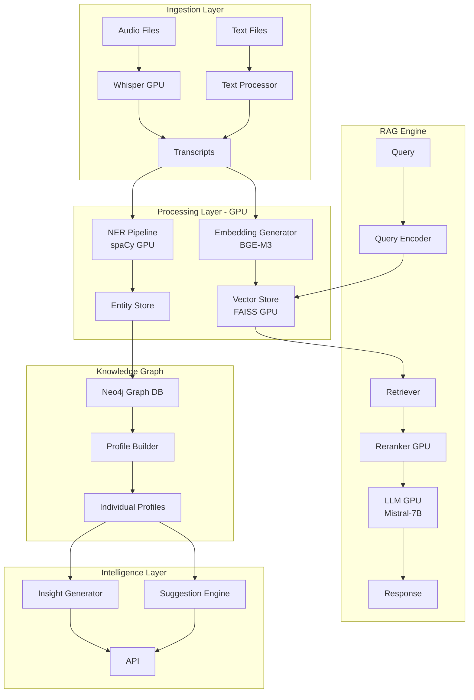

# Spécification: Système RAG pour Analyse de Conversations Professionnelles

## 1. Vue d'ensemble
**Date**: 2025-01-22
**Version**: 1.0
**Auteur**: Équipe Technique
**Statut**: Draft

### Résumé
Développement d'un système RAG spécialisé dans l'analyse de conversations professionnelles (meetings, one-to-one) avec extraction d'informations personnelles et contextuelles, génération de profils individuels et suggestions intelligentes, optimisé pour GPU NVIDIA RTX 3090.

### Objectifs
- [x] Analyser et indexer des conversations multi-modales (texte, audio, GPS, dates)
- [x] Extraire automatiquement les entités et informations personnelles
- [x] Créer des profils détaillés par interlocuteur
- [x] Générer des suggestions contextuelles pour interactions futures
- [x] Exploiter efficacement le GPU RTX 3090 (24GB VRAM)

## 2. Contexte et justification

### Problème à résoudre
Les professionnels accumulent des quantités importantes d'informations lors de conversations, meetings et interactions qu'ils ne peuvent pas mémoriser efficacement. Les informations personnelles sur les interlocuteurs (anniversaires, noms d'enfants, projets) sont cruciales pour maintenir des relations professionnelles de qualité mais sont souvent oubliées.

### Bénéfices attendus
- **Mémorisation augmentée**: Accès instantané à l'historique conversationnel
- **Relations améliorées**: Rappel des détails personnels importants
- **Productivité accrue**: Suggestions contextuelles avant les meetings
- **Intelligence collective**: Patterns et insights sur les interactions

### Utilisateurs cibles
- Managers et dirigeants
- Commerciaux et business developers
- Consultants et coachs
- Professionnels en relation client

## 3. Description fonctionnelle

### User Stories Principales

```
US-001: En tant que manager
Je veux retrouver rapidement ce qui a été dit lors d'un meeting précédent
Afin de préparer efficacement le prochain entretien

US-002: En tant que commercial
Je veux connaître les détails personnels de mon interlocuteur
Afin de personnaliser mon approche et créer une relation de confiance

US-003: En tant que consultant
Je veux être rappelé des dates importantes (anniversaires, événements)
Afin de maintenir une relation personnalisée avec mes clients

US-004: En tant qu'utilisateur
Je veux pouvoir poser des questions naturelles sur mes conversations
Afin d'obtenir des insights sans effort de recherche
```

### Cas d'usage détaillés

#### CU-001: Ingestion d'une conversation
- **Acteur**: Utilisateur
- **Précondition**: Fichier audio/texte disponible
- **Scénario**:
  1. Upload du fichier (audio, transcript, notes)
  2. Transcription automatique si audio
  3. Extraction des métadonnées (date, lieu GPS, participants)
  4. Analyse et extraction des entités
  5. Indexation dans la base vectorielle
  6. Mise à jour des profils participants
- **Postcondition**: Conversation searchable et analysée

#### CU-002: Consultation d'un profil
- **Acteur**: Utilisateur
- **Précondition**: Personne existe dans le système
- **Scénario**:
  1. Recherche par nom
  2. Affichage fiche synthétique
  3. Timeline des interactions
  4. Informations personnelles clés
  5. Suggestions pour prochaine interaction
- **Postcondition**: Vue 360° de la personne

## 4. Exigences techniques

### Exigences fonctionnelles

| ID | Exigence | Priorité | Critère d'acceptation |
|----|----------|----------|----------------------|
| REQ-001 | Transcription audio GPU-accelerée | MUST | Whisper large-v3 sur GPU, <1min pour 1h audio |
| REQ-002 | Extraction entités nommées | MUST | Précision >95% sur noms, dates, lieux |
| REQ-003 | Géolocalisation des meetings | MUST | Support coordonnées GPS + reverse geocoding |
| REQ-004 | Détection relations familiales | MUST | Extraction enfants, conjoint avec 90% précision |
| REQ-005 | Timeline chronologique | MUST | Visualisation temporelle des interactions |
| REQ-006 | Recherche sémantique | MUST | Réponse <200ms avec reranking |
| REQ-007 | Génération profils PDF | SHOULD | Export one-page par personne |
| REQ-008 | Suggestions intelligentes | SHOULD | 5 talking points pertinents par meeting |
| REQ-009 | Détection patterns comportementaux | COULD | Analyse tendances dans conversations |
| REQ-010 | Multi-langue | COULD | Support FR/EN minimum |

### Exigences non-fonctionnelles

#### Performance (RTX 3090)
- **Embeddings generation**: >1000 chunks/sec
- **NER processing**: >500 documents/sec
- **LLM inference**: >50 tokens/sec (7B model)
- **Vector search**: <100ms latency (1M vectors)
- **VRAM usage**: <20GB pour permettre multi-modèles

#### Sécurité
- Chiffrement AES-256 pour données au repos
- TLS 1.3 pour communications
- RGPD compliant avec droit à l'effacement
- Isolation des données par utilisateur
- Audit trail des accès

#### Scalabilité
- Support 10,000+ conversations
- 1,000+ profils actifs
- 50+ utilisateurs concurrents
- Backup incrémental quotidien
- Archivage après 2 ans

## 5. Architecture et design

### Architecture Système



### Modèles de données

```json
// Conversation Schema
{
  "conversation_id": "uuid",
  "date": "2025-01-22T10:30:00Z",
  "location": {
    "name": "Meeting Room A",
    "gps": {
      "latitude": 48.8566,
      "longitude": 2.3522
    }
  },
  "participants": [
    {
      "person_id": "uuid",
      "name": "John Doe",
      "role": "Client"
    }
  ],
  "transcript": "text...",
  "duration_minutes": 45,
  "entities": {
    "persons": ["John Doe", "Marie Doe", "fils Thomas"],
    "dates": ["2025-03-15", "anniversaire en avril"],
    "locations": ["Paris", "New York"],
    "organizations": ["Acme Corp"],
    "projects": ["Project Alpha"]
  },
  "embeddings": [float32],
  "summary": "Discussion sur...",
  "action_items": [],
  "tags": ["commercial", "negotiation"]
}

// Person Profile Schema
{
  "person_id": "uuid",
  "name": "John Doe",
  "aliases": ["JD", "Johnny"],
  "personal_info": {
    "birthday": "1985-04-15",
    "family": {
      "spouse": "Marie Doe",
      "children": [
        {"name": "Thomas", "age": 12},
        {"name": "Sophie", "age": 8}
      ]
    },
    "interests": ["golf", "sailing", "tech startups"]
  },
  "professional": {
    "title": "CEO",
    "company": "Acme Corp",
    "expertise": ["SaaS", "B2B Sales"],
    "current_projects": ["Digital transformation", "Expansion USA"]
  },
  "interaction_stats": {
    "total_meetings": 15,
    "last_interaction": "2025-01-20",
    "frequency": "bi-weekly",
    "total_duration_hours": 22.5
  },
  "communication_style": {
    "prefers": "direct, data-driven",
    "avoid": "small talk prolongé",
    "best_time": "morning"
  },
  "relationship_graph": {
    "reports_to": "person_uuid",
    "collaborates_with": ["person_uuid1", "person_uuid2"],
    "influences": ["person_uuid3"]
  }
}
```

### Stack Technique GPU

```yaml
gpu_configuration:
  device: NVIDIA RTX 3090
  vram: 24GB
  cuda_version: 12.1
  driver: 545.23.08

models:
  transcription:
    name: whisper-large-v3
    vram_usage: 6GB
    optimization: float16, batch_size=8

  embeddings:
    name: BAAI/bge-m3
    vram_usage: 2GB
    optimization: float16, max_length=512

  ner:
    name: camembert-ner + spacy-transformers
    vram_usage: 3GB
    optimization: batch_processing

  llm:
    name: mistral-7b-instruct-v0.2
    quantization: 4-bit GPTQ
    vram_usage: 8GB
    optimization: flash-attention-2

  reranker:
    name: ms-marco-MiniLM-L-12-v2
    vram_usage: 1GB

total_vram_peak: ~20GB (4GB buffer)
```

## 6. Pipeline de traitement

### Ingestion et Préprocessing

```python
# Pipeline configuration
pipeline_stages:
  1_ingestion:
    - audio_transcription:
        model: whisper-large-v3
        language: auto-detect
        batch_size: 8
        use_gpu: true

  2_preprocessing:
    - text_cleaning:
        remove_filler_words: true
        normalize_names: true
    - speaker_diarization:
        min_speakers: 2
        max_speakers: 10

  3_entity_extraction:
    - ner_extraction:
        models: [spacy_gpu, camembert_ner]
        merge_strategy: union
    - date_extraction:
        extract_relative: true  # "next Tuesday"
        extract_birthdays: true
    - location_extraction:
        geocode: true
        extract_gps: true

  4_embedding_generation:
    - text_chunking:
        method: semantic
        chunk_size: 512
        overlap: 50
    - embedding_model:
        model: bge-m3
        normalize: true

  5_profile_update:
    - aggregate_entities: true
    - update_timeline: true
    - calculate_insights: true
```

## 7. Système de suggestions

### Algorithme de génération de suggestions

```python
class SuggestionEngine:
    def generate_meeting_prep(self, person_id, context):
        suggestions = []

        # 1. Rappels personnels
        if upcoming_birthday(person_id):
            suggestions.append({
                "type": "personal",
                "message": "Anniversaire dans 5 jours",
                "action": "Souhaiter anniversaire"
            })

        # 2. Suivi projets
        open_projects = get_open_projects(person_id)
        for project in open_projects:
            suggestions.append({
                "type": "business",
                "message": f"Faire le point sur {project.name}",
                "context": project.last_update
            })

        # 3. Points de vigilance
        concerns = analyze_sentiment_trends(person_id)
        if concerns:
            suggestions.append({
                "type": "attention",
                "message": "Points de préoccupation détectés",
                "details": concerns
            })

        # 4. Opportunités
        opportunities = detect_opportunities(person_id)
        for opp in opportunities:
            suggestions.append({
                "type": "opportunity",
                "message": opp.description,
                "rationale": opp.reasoning
            })

        return rank_suggestions(suggestions, context)
```

## 8. API Endpoints

```yaml
# Core API Specification
api_v1:
  conversations:
    POST /upload: Upload audio/text file
    POST /transcribe: Transcribe audio
    GET /{id}: Get conversation details
    DELETE /{id}: Delete conversation
    GET /search: Semantic search

  profiles:
    GET /list: List all profiles
    GET /{person_id}: Get profile details
    GET /{person_id}/timeline: Get interaction timeline
    GET /{person_id}/insights: Get AI insights
    PUT /{person_id}: Update profile manually

  intelligence:
    POST /ask: Natural language query
    GET /suggestions/{person_id}: Pre-meeting suggestions
    GET /reminders: Upcoming important dates
    POST /analyze/patterns: Detect conversation patterns

  exports:
    GET /profile/{person_id}/pdf: Export profile PDF
    GET /conversation/{id}/transcript: Export transcript
    POST /backup: Full data backup
```

## 9. Métriques et KPIs

### Métriques techniques
- Temps de traitement par heure d'audio: <1 minute
- Latence recherche P95: <200ms
- Précision extraction entités: >95%
- Utilisation GPU moyenne: 60-80%
- Uptime API: >99.9%

### Métriques métier
- Nombre de conversations traitées/jour
- Profils actifs consultés/semaine
- Suggestions utilisées/acceptées
- Temps moyen avant meeting pour consultation
- Score de satisfaction utilisateur (NPS)

## 10. Plan de test

### Tests unitaires
- [x] Extraction entités (accuracy >95%)
- [x] Géolocalisation GPS
- [x] Parsing dates relatives
- [x] Génération embeddings

### Tests d'intégration
- [ ] Pipeline complet audio -> profil
- [ ] RAG chain accuracy
- [ ] Suggestion relevance
- [ ] API performance

### Tests de charge GPU
- [ ] 100 conversations parallèles
- [ ] 10,000 vectors search
- [ ] Memory leak detection
- [ ] VRAM optimization

## 11. Risques et mitigation

| Risque | Probabilité | Impact | Mitigation |
|--------|------------|--------|------------|
| VRAM overflow | Moyen | Élevé | Model quantization, batch size tuning |
| Données sensibles exposées | Faible | Critique | Chiffrement, access control |
| Hallucinations LLM | Moyen | Moyen | Fact-checking, confidence scores |
| Latence élevée | Faible | Moyen | Caching, index optimization |
| Perte de données | Faible | Élevé | Backup automatique, versioning |

## 12. Roadmap

### Phase 1 (MVP) - 4 semaines
- Core pipeline fonctionnel
- Extraction entités basique
- Profils simples
- API minimale

### Phase 2 (Beta) - 4 semaines
- Suggestions intelligentes
- Timeline interactive
- Export PDF
- Optimisations GPU

### Phase 3 (Production) - 4 semaines
- Multi-utilisateur
- Mobile app
- Advanced analytics
- Auto-scaling

---
**Validation**: [ ] Product Owner | [ ] Tech Lead | [ ] Security Officer